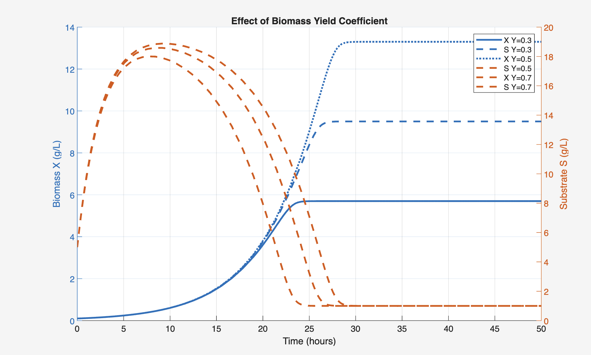
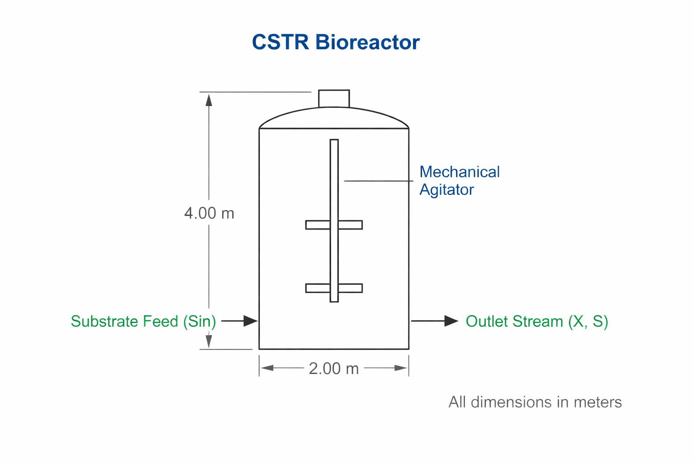

# CSTR Bioreactor Simulation — MATLAB

A dynamic simulation of a continuous stirred tank bioreactor (CSTR) modelling biomass growth and substrate consumption using Monod kinetics and mass balance equations. Built in MATLAB as the original implementation of this model.

## Background

Continuous stirred tank bioreactors are widely used in bioprocessing to maintain steady-state microbial growth under controlled conditions. This model applies Monod kinetics to describe how specific growth rate varies with substrate concentration, and solves the resulting coupled ODEs numerically to simulate transient and steady-state reactor behaviour.

## Model equations

$$\frac{dX}{dt} = (\mu - D) \cdot X$$

$$\frac{dS}{dt} = D \cdot (S_0 - S) - \frac{\mu \cdot X}{Y}$$

$$\mu = \mu_{max} \cdot \frac{S}{K_s + S}$$

Where:
- **X** — biomass concentration (g/L)
- **S** — substrate concentration (g/L)
- **μ** — specific growth rate (h⁻¹)
- **D** — dilution rate (h⁻¹)
- **S₀** — feed substrate concentration (g/L)
- **Y** — biomass yield coefficient (g biomass / g substrate)

## Parameters

| Parameter | Symbol | Value | Units |
|---|---|---|---|
| Maximum specific growth rate | μ_max | 0.4 | h⁻¹ |
| Half-saturation constant | Ks | 0.1 | g/L |
| Yield coefficient | Y | 0.5 | g/g |
| Dilution rate | D | 0.2 | h⁻¹ |
| Feed substrate concentration | S₀ | 10.0 | g/L |

> Update these values in `main_simulation.m` to match your experimental or literature parameters.

## Sample output

## How to run

1. Open MATLAB
2. Navigate to the project folder
3. Open `main_simulation.m`
4. Adjust parameters in the constants section at the top of the file
5. Press **Run** or type `main_simulation` in the MATLAB command window

Output plots are saved automatically as PNG files in the same directory.

## Tools

| Tool | Purpose |
|---|---|
| MATLAB | Core language and numerical environment |
| `ode45` | Built-in Runge-Kutta ODE solver |
| MATLAB Plotting | Figure generation and export |
| AutoCAD | Reactor layout schematic (see `/autocad`) |

## AutoCAD schematic

A simplified reactor layout was designed in AutoCAD to visually represent the system assumptions and flow configuration of the CSTR model.

> The schematic is included for reference and does not affect the simulation output.

## Related

- [Python version](https://github.com/your-username/bioreactor-cstr-python) — port of this model using scipy and matplotlib

## Author

Monther Al Khateeb — Chemical and Biological Engineering, American University of Sharjah  
[LinkedIn](https://linkedin.com/in/monther-al-khateeb-6a1363319)
